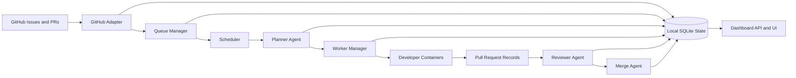

# Architecture

## Objectives

The swarm orchestration framework must:

- ingest and prioritize GitHub issues
- maintain a durable issue queue
- assign one issue to one worker agent
- create a plan before code changes start
- run multiple isolated workers in parallel
- review and merge completed pull requests
- persist state locally for restart safety
- expose a dashboard for operational control

## Architectural style

The MVP uses a modular monolith with explicit boundaries:

- **Control plane**: scheduler, assignment, lifecycle management, policy enforcement
- **Execution plane**: planner, developer, reviewer, and merge agents running in Podman containers
- **Data plane**: local SQLite state store, event log, workspace metadata, and artifacts
- **Presentation plane**: dashboard API and HTML UI for live status

This keeps the first version simple while preserving a clean path toward microservices later.

## Component diagram

## Core runtime components

### 1. GitHub adapter

Responsibilities:

- poll issues from GitHub
- normalize issues into internal records
- sync pull request metadata
- update merge results back to the local store

Output:

- `IssueRecord`
- `PullRequestRecord`
- `RepositorySnapshot`

### 2. Queue manager

Responsibilities:

- accept issues from the GitHub adapter
- apply priority and readiness rules
- deduplicate and lock assignments
- maintain queue status transitions

Primary states:

- `queued`
- `planned`
- `assigned`
- `in_progress`
- `review_pending`
- `approved`
- `merged`
- `blocked`
- `failed`

### 3. Planner agent

Responsibilities:

- consume a queued issue
- analyze repository context
- produce an implementation plan artifact
- estimate scope, dependencies, and risk

Planner output becomes the contract passed to a developer agent.

### 4. Worker manager

Responsibilities:

- reserve an issue for execution
- spawn a Podman container per worker
- inject issue context, plan, and workspace path
- track runtime, heartbeats, and completion state

Invariant:

- one active developer worker per issue

### 5. Reviewer agent

Responsibilities:

- inspect completed pull requests
- validate required checklist items
- record approve, request-changes, or reject decisions

### 6. Merge agent

Responsibilities:

- verify approval and policy checks
- serialize merges where required
- update merge status and audit records

### 7. Local state store

Responsibilities:

- persist issue queue
- persist agent lifecycle state
- persist plan and run metadata
- recover execution after restarts

Storage choices:

- SQLite for structured state
- filesystem artifacts for plans, logs, transcripts, patches, and summaries

### 8. Dashboard

Responsibilities:

- show active agents
- show issue assignments
- show pull request status
- show merge status
- expose operational APIs for observability

## High-level flow

### Issue to merge lifecycle

1. GitHub adapter syncs open issues.
2. Queue manager creates or updates queue records.
3. Scheduler selects the next eligible issue.
4. Planner agent creates a plan artifact.
5. Worker manager assigns the issue to one developer agent.
6. Developer agent works inside a dedicated Podman container.
7. Pull request metadata is captured and routed to review.
8. Reviewer agent records a decision.
9. Merge agent merges approved PRs.
10. Dashboard reflects the final state.

## Concurrency model

- scheduler loop is single-writer for assignment decisions
- multiple worker containers run in parallel
- reviewer and merge steps can be independent queues
- SQLite transactions protect queue reservations and status transitions

This avoids duplicate issue assignment while still allowing concurrent implementation.

## Isolation model with Podman

Each agent run gets:

- a unique container name
- a unique workspace directory
- a read-write state volume
- scoped environment variables
- a dedicated transcript and log path

Recommended directories:

- `var/state/` — SQLite and durable metadata
- `var/artifacts/` — plans, logs, review outputs
- `var/workspaces/<run-id>/` — ephemeral agent working copy

## Persistence model

The MVP persists four categories of state locally:

1. **Operational state** — queue, assignments, runs, PR lifecycle
2. **Agent state** — role, status, heartbeat, container id, exit status
3. **Artifacts** — plan documents, review summaries, merge notes
4. **Audit trail** — append-only event records for debugging and replay

## Service boundaries in code

- `domain/` contains pure types and state transitions
- `services/` contains orchestration policies and scheduling logic
- `adapters/` contains GitHub, Podman, storage, and filesystem integrations
- `api/` exposes operational endpoints and dashboard views

## Security and safety principles

- no direct merge without explicit policy validation
- containerized execution for planner, developer, reviewer, and merger roles
- local audit trail for every assignment and merge action
- clear separation between control plane and execution plane

## Evolution path

The MVP should later expand toward:

- webhook-driven issue ingestion
- richer queue prioritization
- branch and PR automation
- policy-driven merge gates
- remote state backends and distributed schedulers
